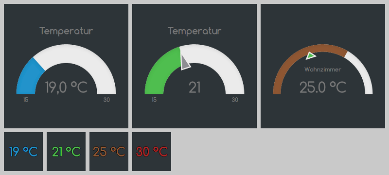

ioBroker.vis-justgage
============

[justGage](http://justgage.com/) Widget for ioBroker.

## Changelog

### 0.4.0 (2016-02-19)
- (Pmant) replace pow with sliders
- (bluefox) fix resize

### 0.3.0 (2016-02-16)
- (bluefox) fix error with two gauges at creation
- (bluefox) fix small errors
- (bluefox) add new widget: value & indication
- (bluefox) fill automatically max, min, unit

### 0.2.5 (2016-02-13)
- (Pmant) fix indicator
- (bluefox) add russian translations

### 0.2.2 (2016-02-12)
- (Pmant) possible donut fix

### 0.2.0 (2016-02-11)
- (Pmant) add indicator widget

### 0.1.1 (2016-02-10)
- (Pmant) initial checkin

## License
 Copyright (c) 2015-2016 Pmant
 MIT
